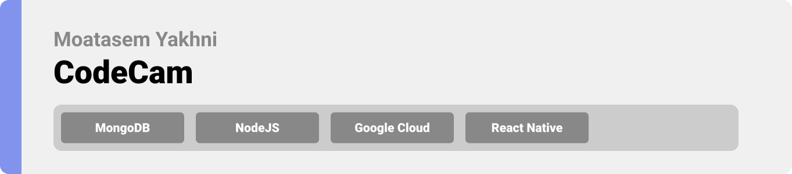
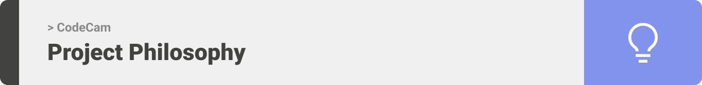
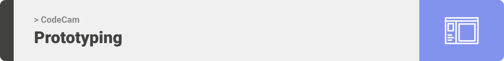
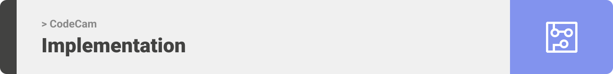

<div align="center">

> CodeCam allows users to take picture of their, typed or handwritten, code and run it on the app at anytime. 


**[PROJECT PHILOSOPHY](https://github.com/moatasemyakhni/codecam#-project-philosophy) • [WIREFRAMES](https://github.com/moatasemyakhni/codecam#-wireframes) • [TECH STACK](https://github.com/moatasemyakhni/codecam#-tech-stack) • [IMPLEMENTATION](https://github.com/moatasemyakhni/codecam#-impplementation) • [HOW TO RUN?](https://github.com/moatasemyakhni/codecam#-how-to-run)**

</div>

<br><br>




> Codecam is a mobile app that allows users to take a photo of their code. They have the option to run the code and edit it anytime. Photos taken are easily accessed through the history tab in which picture, picture content, date and title name are represented and sorted
> 
> It supports more than 5 programming languages such as Javascript, Java and Python

### User Stories
- As a teacher, I want to know if my student's code output is correct
- As an intellectual coder, I want to easily test my hypothesis 
- As a developer, I want to discover new ways to code

<br><br>



> This design was planned before on paper, then moved to Figma app for the fine details.
Note that i didn't use any styling library or theme, all from scratch and using pure css modules

| Landing WireFrame | Home Mockup |
| -----------------| -----|
|  |  |

| Home WireFrame | Home Mockup |
| -----------------| -----|
|  |  |

| Run Code WireFrame | Run Code Mockup |
| -----------------| -----|
|  |  |

| History WireFrame | History Mockup |
| -----------------| -----|
|  |  |

| Setting WireFrame | Setting Mockup |
| -----------------| -----|
|  |  |


| Edit WireFrame | Edit Mockup |
| -----------------| -----|
|  |  |

| Sign up WireFrame | Sign up Mockup |
| -----------------| -----|
|  |  |

| Forgot Password WireFrame | Forgot Password Mockup |
| -----------------| -----|
|  |  |


<br><br>


Here's a brief high-level overview of the tech stack the CodeCam app uses:

- This project uses the [React Native app development framework](https://reactnative.dev/). React Native combines the best parts of native development with React, a best-in-class JavaScript library for building user interfaces..
- For persistent storage (database), the app uses [Mongoose](https://mongoosejs.com/) library which allows the app to create a straight-forward, schema-based solution to model the application data.

- The app uses the font ["Roboto"](https://fonts.google.com/specimen/Roboto) as its main font for Android, and it uses ["san Francisco"](https://www.dafontfree.io/san-francisco-font-free) as its main font for IOS.


<br><br>


> Uing the above mentioned tecch stacks and the wireframes build with figma from the user sotries we have, the implementation of the app is shown as below, these are screenshots from the real app

| Landing | Landing |
| -----------------| -----|
|  |  |

| Home | Home |
| -----------------| -----|
|  |  |

| Run Code | Run Code |
| -----------------| -----|
|  |  |

| History | History |
| -----------------| -----|
|  |  |

| Setting | Setting |
| -----------------| -----|
|  |  |

| Edit Profile | Edit Profile |
| -----------------| -----|
|  |  |

| Sign up | Sign up |
| -----------------| -----|
|  |  |

| Forgot Password | Forgot Password |
| -----------------| -----|
|  |  |


<br><br>


> Make sure to have these packages installed before running the application.

### Prerequisites

* npm
  ```sh
  npm install npm@latest -g
  ```
* expo CLI
   ```sh
   npm install -g expo-cli
   ```

### Installation

1. create service account at [console google cloud](https://console.cloud.google.com/getting-started) after creating a project on google
2. Get a free API Key at [hacker earth](https://www.hackerearth.com/docs/wiki/developers/v4/)
3. generate 'App Pass' for your gmail account following these [steps](https://support.google.com/mail/answer/185833?hl=en)
4. Clone the repo
   ```sh
   git clone https://github.com/moatasemyakhni/codecam.git
   ```
5. Install NPM packages
   ```sh
   npm install
   ```


